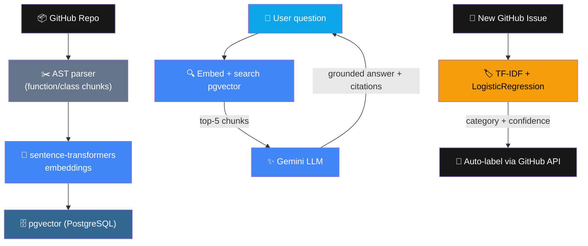

# 🧠 CodeMind — Chat With Your Codebase (RAG + ML)


-brightgreen)

> An AI-powered semantic search and Q&A tool for GitHub codebases — plus an ML-based issue auto-triage system. Ask natural-language questions about any repo and get grounded answers with file/line citations.

---

## 📖 Table of Contents

- [What This Is](#-what-this-is)
- [Architecture](#-architecture)
- [Folder Structure](#-folder-structure)
- [Prerequisites](#-prerequisites)
- [Part 1 — API Keys & Accounts](#part-1--api-keys--accounts)
- [Part 2 — Database Setup (pgvector)](#part-2--database-setup-pgvector)
- [Part 3 — Backend Setup](#part-3--backend-setup)
- [Part 4 — Frontend Setup](#part-4--frontend-setup)
- [Part 5 — Training the Issue Classifier](#part-5--training-the-issue-classifier)
- [Part 6 — GitHub Webhook Setup](#part-6--github-webhook-setup)
- [Part 7 — Running Everything Locally](#part-7--running-everything-locally)
- [Part 8 — Deployment](#part-8--deployment)
- [Cost Breakdown](#-cost-breakdown)
- [Interview Talking Points](#-interview-talking-points)

---

## 🎯 What This Is

Two features in one project:

1. **RAG-powered code Q&A** — index any GitHub repo's Python files (parsed by function/class using the `ast` module), embed them, store in pgvector, and answer natural-language questions grounded in the actual code with citations.
2. **ML-based issue auto-triage** — a scikit-learn classifier (TF-IDF + Logistic Regression) trained on historical labeled GitHub issues, automatically labels new issues as `bug`, `feature_request`, `question`, or `duplicate` via a webhook.

---

## 🔀 Architecture



---

## 📁 Folder Structure

```
codemind/
├── README.md
├── frontend/                          # Next.js app
│   ├── package.json
│   ├── next.config.js
│   ├── tailwind.config.js
│   ├── postcss.config.js
│   ├── tsconfig.json
│   ├── .env.local.example
│   └── app/
│       ├── layout.tsx
│       ├── globals.css
│       ├── page.tsx                   # Connect/index a repo
│       └── chat/page.tsx              # Chat UI
└── backend/                           # Python FastAPI app
    ├── requirements.txt
    ├── .env.example
    ├── main.py                        # API routes
    ├── db.py                          # Postgres/pgvector connection
    ├── schema.sql                     # Table definitions
    ├── indexer.py                     # Clone, AST parse, chunk, embed
    ├── chat.py                        # Retrieval + LLM generation
    ├── webhook.py                     # Issue auto-triage webhook
    └── classifier/
        ├── fetch_training_data.py     # Pull labeled issues from GitHub
        ├── train.py                   # Train TF-IDF + LogisticRegression
        └── predict.py                 # Load model, predict category
```

---

## ✅ Prerequisites

- [ ] Node.js 18+ and Python 3.10+
- [ ] PostgreSQL with the ability to install extensions (local install, or a free-tier managed Postgres from Render/Railway/Supabase — all support pgvector)
- [ ] Free Gemini API key from [ai.google.dev](https://ai.google.dev)
- [ ] GitHub Personal Access Token
- [ ] Git installed locally

---

## Part 1 — API Keys & Accounts

**Gemini API key:**
1. Go to `ai.google.dev` → **Get API key** → sign in → **Create API key** → copy it

**GitHub Personal Access Token:**
1. GitHub → **Settings → Developer settings → Personal access tokens → Fine-grained tokens → Generate new token**
2. Permissions needed: **Issues: Read & write**, **Contents: Read-only**
3. Copy the token

**GitHub Webhook Secret:** just generate any random string yourself (used to verify webhook authenticity):
```bash
openssl rand -hex 20
```

---

## Part 2 — Database Setup (pgvector)

**Option A — Local Postgres:**
```bash
# Install pgvector extension (Mac via Homebrew)
brew install pgvector

# Create the database
createdb codemind
```

**Option B — Free managed Postgres (Render, Railway, or Supabase — all support pgvector):**
1. Create a free Postgres instance on any of these
2. Copy the connection string they give you

Either way, once you have a `DATABASE_URL`, run the schema:
```bash
cd backend
python db.py
```
This enables the `vector` extension and creates all tables (`repos`, `code_chunks`, `issue_predictions`).

---

## Part 3 — Backend Setup

```bash
cd backend
python -m venv venv
source venv/bin/activate      # Windows: venv\Scripts\activate
pip install -r requirements.txt

cp .env.example .env
# Fill in DATABASE_URL, GEMINI_API_KEY, GITHUB_TOKEN, GITHUB_WEBHOOK_SECRET
```

Run the API server:
```bash
uvicorn main:app --reload --port 8000
```

Visit `http://localhost:8000` — you should see `{"status": "ok", "service": "CodeMind API"}`.

---

## Part 4 — Frontend Setup

```bash
cd frontend
npm install
cp .env.local.example .env.local
# Set NEXT_PUBLIC_API_URL=http://localhost:8000
npm run dev
```

Visit `http://localhost:3000` — enter a repo like `psf/requests` (a smaller, well-known Python repo, good for testing) and click **Index Repository**.

---

## Part 5 — Training the Issue Classifier

```bash
cd backend/classifier
python fetch_training_data.py    # pulls labeled issues from a public repo
python train.py                  # trains and saves issue_classifier.joblib
```

You'll see a `classification_report` printed showing precision/recall per category — this tells you how well the model performs before trusting it in production. The trained model is saved as `issue_classifier.joblib` in the `classifier/` folder, which `predict.py` loads automatically.

**To train on a different repo's issues**, edit the repo name at the bottom of `fetch_training_data.py`.

---

## Part 6 — GitHub Webhook Setup

To enable auto-triage on your own repo:

1. Go to your repo → **Settings → Webhooks → Add webhook**
2. **Payload URL:** `https://your-backend-url.com/webhook/issues`
3. **Content type:** `application/json`
4. **Secret:** the same value you set as `GITHUB_WEBHOOK_SECRET`
5. **Which events:** select **Issues** only
6. Save

Now every new issue opened on that repo will trigger the classifier and auto-apply a label if confidence is high enough.

---

## Part 7 — Running Everything Locally

```bash
# Terminal 1 — backend
cd backend
source venv/bin/activate
uvicorn main:app --reload --port 8000

# Terminal 2 — frontend
cd frontend
npm run dev
```

**Test flow:**
1. Visit `localhost:3000` → index a repo (e.g., `psf/requests`)
2. Wait for indexing to complete → redirected to chat
3. Ask: *"How does this library handle retries?"*
4. See a grounded answer with file/line citations

**Test the webhook locally** (needs a public URL — use `ngrok`):
```bash
ngrok http 8000
```
Use the ngrok HTTPS URL as your webhook's Payload URL temporarily while testing.

---

## Part 8 — Deployment

### Backend → Render or Railway (free tier)
1. Push the `backend/` folder to a GitHub repo
2. Create a new **Web Service** on Render/Railway, point it at your repo
3. Set build command: `pip install -r requirements.txt`
4. Set start command: `uvicorn main:app --host 0.0.0.0 --port $PORT`
5. Add all environment variables from `.env` in the platform's dashboard
6. Deploy — you'll get a live URL like `https://codemind-backend.onrender.com`

### Database → Render/Railway/Supabase managed Postgres
Use their free-tier Postgres, enable the `vector` extension via their SQL console, then run `schema.sql` against it.

### Frontend → Vercel
```bash
cd frontend
npm install -g vercel
vercel login
vercel
```
Set `NEXT_PUBLIC_API_URL` to your deployed backend URL in Vercel's environment variables, then:
```bash
vercel --prod
```

### Update your GitHub webhook
Change the Payload URL to your real deployed backend: `https://your-backend.onrender.com/webhook/issues`

---

## 💰 Cost Breakdown

| Resource | Free Tier | Cost |
|---|---|---|
| Vercel (frontend) | 100GB bandwidth/mo | $0 |
| Render/Railway (backend + Postgres) | Free tier available | $0 |
| Gemini API | Free tier | $0 |
| sentence-transformers | Runs locally, no API | $0 |
| scikit-learn | Local training, no API | $0 |

**Total: $0/month** for personal/demo use.

---

## 🎤 Interview Talking Points

- **Why AST parsing instead of naive text chunking:** code has structure — chunking by function/class (not arbitrary word counts) keeps each embedding semantically coherent and enables precise file/line citations.
- **Why pgvector instead of a dedicated vector DB:** one database handles both structured data and vector search — simpler infra, no extra service to manage.
- **Why a classical ML model (not an LLM) for issue triage:** it's a well-defined, small-output classification task — TF-IDF + Logistic Regression trains in seconds, costs nothing per prediction, and is easy to retrain as label definitions evolve. Using an LLM here would be slower and costlier for no real accuracy benefit.
- **Where training data came from:** pulled real historical labeled issues via the GitHub API — no manual labeling needed, a production-realistic way to bootstrap a dataset.
- **Confidence thresholding:** the webhook only auto-applies a label above a confidence threshold, otherwise leaves it for a human — avoiding confidently wrong auto-labels.

---

## 🔮 Future Improvements

- [ ] Support multi-language parsing via `tree-sitter` (currently Python-only via `ast`)
- [ ] Add streaming responses in the chat UI
- [ ] Add a feedback mechanism (👍/👎) to track answer quality
- [ ] Re-train the classifier periodically as new labeled issues accumulate
- [ ] Add authentication so multiple users can index their own private repos

---

<p align="center">Built as a developer-focused RAG + ML project combining semantic code search with automated issue triage.</p>
